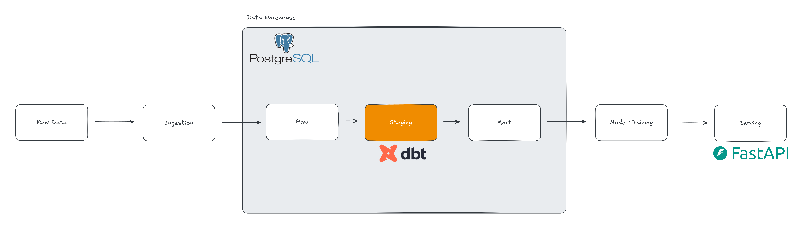

# 🚀 Customer Churn Pipeline (dbt + ML + FastAPI)

## 📌 Overview

Project ini merupakan **end-to-end data pipeline** untuk analisis dan prediksi *customer churn*, mulai dari proses data ingestion, transformasi menggunakan **dbt**, hingga **machine learning model** dan **API serving** menggunakan FastAPI.

Project ini mensimulasikan workflow nyata di dunia data:

* Data Engineering (ETL/ELT)
* Data Modeling (Star Schema)
* Machine Learning
* Model Deployment (API)

---

## 🏗️ Pipeline Architecture



### 🔄 Alur Pipeline:

1. **Raw Layer**

   * Data mentah dimasukkan ke PostgreSQL

2. **Staging Layer (dbt)**

   * Cleaning data
   * Rename kolom
   * Handling missing values

3. **Mart Layer (dbt)**

   * Feature engineering
   * Contoh: `tenure_group`
   * Output: `fact_churn`

4. **Machine Learning**

   * Model: Random Forest Classifier
   * Training menggunakan data dari `fact_churn`

5. **Model Serving**

   * API dibuat dengan FastAPI
   * Endpoint `/predict` untuk prediksi churn

---

## 🧰 Tech Stack

* 🐘 PostgreSQL → Data Warehouse
* 🧱 dbt → Data Transformation
* 🐍 Python → Data Processing & ML
* 🤖 Scikit-learn → Machine Learning Model
* ⚡ FastAPI → API Serving
* 📦 Joblib → Model Serialization

---

## 📁 Project Structure

```
customer_churn_pipeline/
│
├── models/                # dbt models
│   ├── staging/
│   └── marts/
│
├── ml/                    # Machine Learning & API
│   ├── api.py
│   ├── train_model.py
│
├── dbt_project.yml
├── requirements.txt
└── README.md
```

---

## ⚙️ Setup Instructions

### 1. Clone Repository

```bash
git clone https://github.com/nopal-fz/Customer-Churn-Pipeline-Dbt.git
cd Customer-Churn-Pipeline-Dbt
```

---

### 2. Setup Environment

```bash
python -m venv dbt-venv
dbt-venv\Scripts\activate   # Windows

pip install -r requirements.txt
```

---

### 3. Run dbt Models

```bash
dbt run
```

---

### 4. Train Machine Learning Model

```bash
python ml/train_model.py
```

---

### 5. Run FastAPI Server

```bash
uvicorn ml.api:app --reload
```

---

### 6. Open API Docs

```
http://127.0.0.1:8000/docs
```

---

## 🔮 API Example

### Request:

```json
{
  "tenure": 5,
  "monthlycharges": 70,
  "totalcharges": 300,
  "tenure_group": "new"
}
```

### Response:

```json
{
  "churn_prediction": 1
}
```

---

## 📊 Feature Engineering

Contoh fitur:

* `tenure`
* `monthlycharges`
* `totalcharges`
* `tenure_group` (new, mid, long)

---

## 🎯 Model

* Algorithm: Random Forest Classifier
* Target: `churn`
* Preprocessing:

  * One-hot encoding
  * Feature alignment

---

## 🚀 Future Improvements

* Add more features from raw dataset
* Model evaluation (confusion matrix, ROC-AUC)
* Deploy API ke cloud (Render / Railway)
* Add dashboard (Streamlit / Metabase)

---

## 👨‍💻 Author

**Naufal Faiz**
